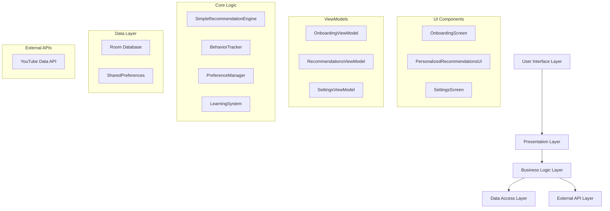

# Lightweight Music Suggestion System - Design Document

## Overview

The Lightweight Music Suggestion System is designed as a modular, AI-friendly architecture that provides personalized music recommendations through simple Kotlin logic. The system emphasizes local data processing, minimal resource usage, and immediate user personalization without complex ML dependencies.

## Architecture

### High-Level Architecture



### System Flow

1. **Initialization**: Check onboarding status and load preferences
2. **Onboarding**: Collect user preferences and save locally
3. **Recommendation Generation**: Combine preferences with behavioral data
4. **Content Fetching**: Query YouTube API with generated keywords
5. **Ranking**: Score and rank candidates using weighted algorithm
6. **Display**: Present top 16 songs in 4×4 grid
7. **Learning**: Update weights based on user interactions

## Components and Interfaces

### 1. Data Models

#### UserPreferences
```kotlin
data class UserPreferences(
    val genres: List<String>,
    val moods: List<String>,
    val language: String,
    val isOnboardingComplete: Boolean = false
)
```

#### SongStats (Room Entity)
```kotlin
@Entity(tableName = "song_stats")
data class SongStats(
    @PrimaryKey val songId: String,
    val genre: String,
    val mood: String,
    val artist: String,
    var playCount: Int = 0,
    var likeCount: Int = 0,
    var skipCount: Int = 0,
    var lastPlayedTime: Long = 0,
    var inPlaylist: Boolean = false
)
```

#### TasteWeights
```kotlin
data class TasteWeights(
    val genreWeights: Map<String, Float>,
    val moodWeights: Map<String, Float>,
    val artistWeights: Map<String, Float>,
    val lastUpdated: Long
)
```

### 2. Core Components

#### PreferenceManager
- **Purpose**: Handle SharedPreferences operations for user preferences
- **Key Methods**:
  - `saveUserPreferences(preferences: UserPreferences)`
  - `getUserPreferences(): UserPreferences?`
  - `isOnboardingComplete(): Boolean`
  - `updatePreferences(preferences: UserPreferences)`

#### BehaviorTracker
- **Purpose**: Track and store user interactions with songs
- **Key Methods**:
  - `onSongPlayed(songId: String, metadata: SongMetadata)`
  - `onSongLiked(songId: String)`
  - `onSongSkipped(songId: String)`
  - `onSongAddedToPlaylist(songId: String)`
  - `getSongStats(songId: String): SongStats?`

#### SimpleRecommendationEngine
- **Purpose**: Core recommendation logic using weighted scoring
- **Key Methods**:
  - `getRecommendations(limit: Int = 16): List<Song>`
  - `generateKeywords(preferences: UserPreferences, weights: TasteWeights): List<String>`
  - `scoreSong(song: Song, preferences: UserPreferences, stats: SongStats?): Double`
  - `rankCandidates(candidates: List<Song>): List<Song>`

#### LearningSystem
- **Purpose**: Adaptive weight adjustment based on user behavior
- **Key Methods**:
  - `updateWeights(): TasteWeights`
  - `analyzeUserBehavior(timeWindow: Long): BehaviorAnalysis`
  - `adjustGenreWeights(analysis: BehaviorAnalysis): Map<String, Float>`
  - `shouldUpdateWeights(): Boolean`

### 3. UI Components

#### OnboardingScreen
- **Layout**: Vertical scrolling with checkbox groups
- **Sections**: Genre selection, Language selection, Mood preferences
- **Actions**: Continue button, Skip option
- **Validation**: Ensure at least one selection per category

#### PersonalizedRecommendationsUI
- **Layout**: 4×4 RecyclerView with GridLayoutManager
- **Card Design**: Cover art, title, artist, action buttons
- **Scrolling**: Sticky horizontal scroll for additional recommendations
- **Actions**: Play, Like, Add to Playlist, Skip

#### SettingsScreen
- **Sections**: Edit Preferences, Clear Data, Reset Recommendations
- **Preferences**: Same UI as onboarding with current selections highlighted
- **Data Management**: Options to clear behavioral data or reset weights

## Data Models

### Database Schema (Room)

#### SongStats Table
```sql
CREATE TABLE song_stats (
    songId TEXT PRIMARY KEY,
    genre TEXT NOT NULL,
    mood TEXT,
    artist TEXT NOT NULL,
    playCount INTEGER DEFAULT 0,
    likeCount INTEGER DEFAULT 0,
    skipCount INTEGER DEFAULT 0,
    lastPlayedTime INTEGER DEFAULT 0,
    inPlaylist INTEGER DEFAULT 0
);
```

#### Indexes for Performance
```sql
CREATE INDEX idx_genre ON song_stats(genre);
CREATE INDEX idx_artist ON song_stats(artist);
CREATE INDEX idx_last_played ON song_stats(lastPlayedTime);
```

### SharedPreferences Structure
```json
{
  "user_preferences": {
    "genres": ["pop", "rock", "indie"],
    "moods": ["chill", "energetic"],
    "language": "english",
    "onboarding_complete": true
  },
  "taste_weights": {
    "genre_weights": {"pop": 1.2, "rock": 0.8, "indie": 1.5},
    "mood_weights": {"chill": 1.3, "energetic": 0.9},
    "last_updated": 1640995200000
  }
}
```

## Error Handling

### Error Categories and Responses

1. **Network Errors** (YouTube API failures)
   - Fallback to cached recommendations
   - Display offline message if no cache available
   - Retry mechanism with exponential backoff

2. **Data Corruption**
   - Validate data integrity on app start
   - Reset to defaults if corruption detected
   - Log errors for debugging

3. **Storage Errors**
   - Handle SharedPreferences write failures
   - Implement Room database migration strategies
   - Graceful degradation when storage is full

4. **Algorithm Errors**
   - Fallback to basic preference-only recommendations
   - Handle edge cases (no behavioral data, empty preferences)
   - Prevent infinite loops in weight adjustment

### Error Recovery Strategies

```kotlin
class ErrorHandler {
    fun handleRecommendationError(error: Exception): List<Song> {
        return when (error) {
            is NetworkException -> getCachedRecommendations()
            is DataCorruptionException -> getDefaultRecommendations()
            else -> getPopularSongs()
        }
    }
}
```

## Testing Strategy

### Unit Testing

1. **PreferenceManager Tests**
   - Save/load preferences correctly
   - Handle malformed data gracefully
   - Validate onboarding completion logic

2. **BehaviorTracker Tests**
   - Accurate interaction counting
   - Proper timestamp handling
   - Database transaction integrity

3. **SimpleRecommendationEngine Tests**
   - Scoring algorithm accuracy
   - Keyword generation logic
   - Ranking consistency

4. **LearningSystem Tests**
   - Weight adjustment calculations
   - Behavior analysis accuracy
   - Update trigger conditions

### Integration Testing

1. **End-to-End Recommendation Flow**
   - Onboarding → Preferences → Recommendations
   - User interaction → Behavior tracking → Weight updates
   - API integration → Data processing → UI display

2. **Data Persistence Testing**
   - App restart scenarios
   - Data migration between versions
   - Storage limit handling

### UI Testing

1. **Onboarding Flow**
   - All selection combinations work
   - Navigation and validation
   - Preference persistence

2. **Recommendations UI**
   - Grid layout rendering
   - Smooth scrolling performance
   - Action button functionality

### Performance Testing

1. **Memory Usage**
   - Monitor heap allocation during recommendation generation
   - Verify 2MB memory limit compliance
   - Test with large behavioral datasets

2. **Response Time**
   - Recommendation generation under 2 seconds
   - UI responsiveness during background processing
   - Database query optimization

3. **Storage Efficiency**
   - Verify 50KB preference storage limit
   - Monitor database growth over time
   - Test data cleanup effectiveness

## Implementation Notes

### AI-Friendly Design Principles

1. **Modular Architecture**: Each component has single responsibility
2. **Clear Interfaces**: Well-defined method signatures and data contracts
3. **Comprehensive Documentation**: Detailed comments and examples
4. **Error Handling**: Explicit error cases and recovery strategies
5. **Testable Design**: Easy to unit test and mock dependencies

### Development Phases

1. **Phase 1**: Core data models and preference management
2. **Phase 2**: Basic recommendation engine and UI
3. **Phase 3**: Behavioral tracking and learning system
4. **Phase 4**: Performance optimization and error handling
5. **Phase 5**: Testing and refinement

### Configuration Constants

```kotlin
object RecommendationConfig {
    const val PREFERENCE_WEIGHT = 0.8f
    const val BEHAVIOR_WEIGHT = 0.2f
    const val MAX_RECOMMENDATIONS = 16
    const val LEARNING_UPDATE_INTERVAL = 24 * 60 * 60 * 1000L // 24 hours
    const val MIN_INTERACTIONS_FOR_LEARNING = 10
    const val MAX_STORAGE_SIZE_KB = 50
    const val MAX_MEMORY_USAGE_MB = 2
}
```

This design provides a solid foundation for AI-assisted implementation while maintaining the lightweight, privacy-focused approach outlined in your requirements.